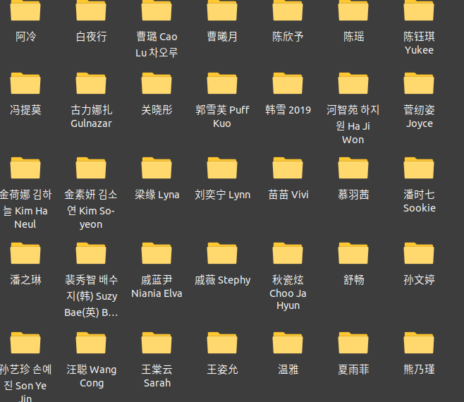
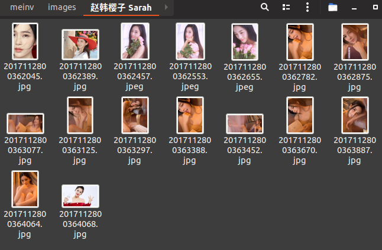
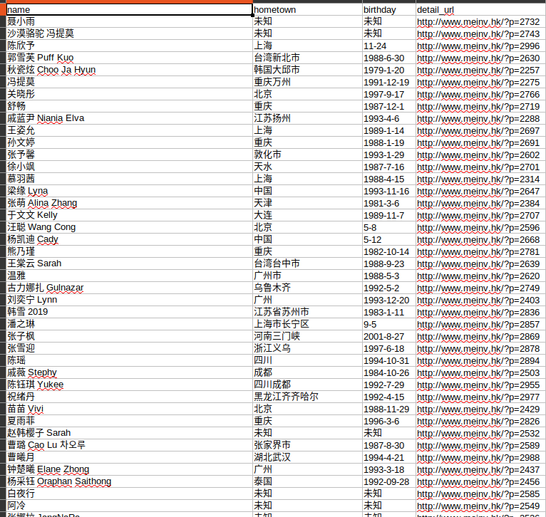

# 美女网(附数据)

如果对您有帮助，希望给个 Star ⭐，谢谢！😁😘🎁🎉

Github 项目地址 [pighui](https://github.com/pighui)/[meinv](https://github.com/pighui/meinv)

# 简介

基于Scrapy框架的读书网信息爬取

爬虫入口地址：<http://www.meinv.hk/?cat=2>

实现了以下部分：

- 美女信息提取

姓名、故乡、生日等信息

- 图片地址提取

提取每个页面中符合规则的图片地址

- 图片下载

自定义图片下载管道，按名字目录保存每人个人的图片。

- 数据保存

自定义数据管道，保存csv文件

# 克隆项目

```bash
git clone git@github.com:pighui/meinv.git
```

# 项目启动

## 1.安装环境包

测试环境：python3.7

```bash
cd meinv
pip install -r requirements.txt
```

**或者**

```python
pip install scrapy pillow
```

## 2.运行爬虫

```bash
scrapy crawl mv
```

# 数据概览

## 1.文件目录



## 2.某人图片



## 3.csv文件内容

