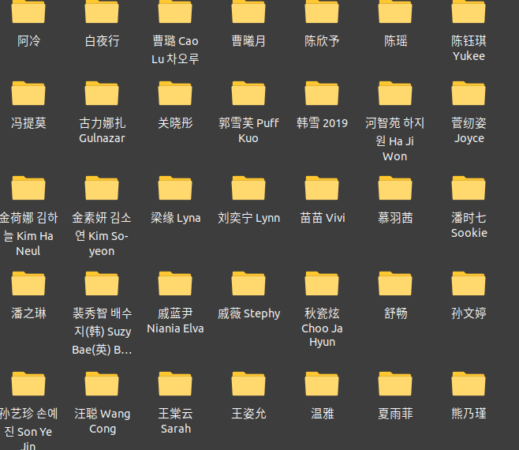
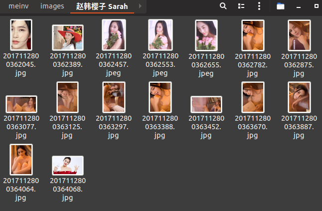
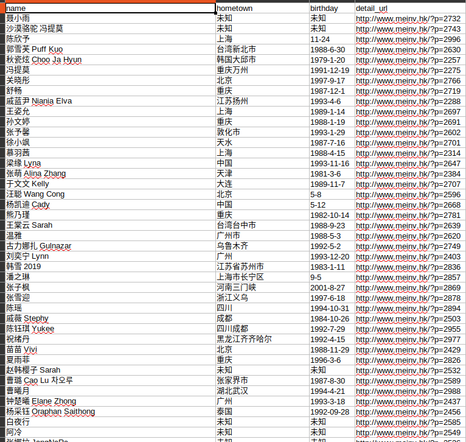

# 美女网

如果对您有帮助，希望给个 Star ⭐，谢谢！😁😘🎁🎉

Github 项目地址 [pighui](https://github.com/pighui)/[meinv](https://github.com/pighui/meinv)

# 简介

基于Scrapy框架的读书网信息爬取

爬虫入口地址：<http://www.meinv.hk/?cat=2>

如果你的爬虫运行正常却没有数据，可能的原因是访问该网站需要梯子。

# 技术点

自定义图片管道

自定义csv数据管道

# 克隆项目

```bash
git clone git@github.com:pighui/meinv.git
```

# 项目启动

## 1.安装环境包

开发环境：python3.7

```bash
cd meinv
pip install -r requirements.txt
```

## 2.运行爬虫

```bash
scrapy crawl mv
```

# 数据概览

## 1.文件目录



## 2.某人图片



## 3.csv文件内容

